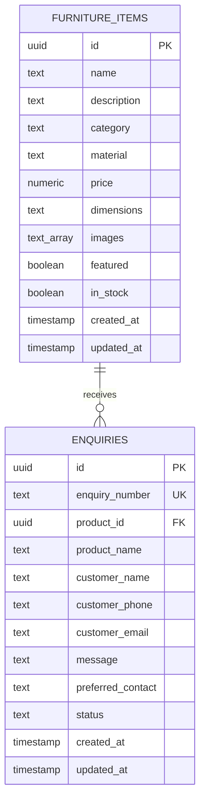

# Maison & Co — Database Schema

This document details the database schema, table definitions, relationships, and Row Level Security (RLS) policies implemented in Supabase Postgres.

## 1. Entity Relationship Diagram

## 2. Table Definitions

### TABLE: `furniture_items`
Stores information about the high-end furniture items in the catalogue.

| Column | Type | Constraints | Default | Description |
| :--- | :--- | :--- | :--- | :--- |
| `id` | `uuid` | PRIMARY KEY | `gen_random_uuid()` | Unique identifier |
| `name` | `text` | NOT NULL | - | Name of the piece |
| `description` | `text` | NOT NULL | - | Detailed description |
| `category` | `text` | NOT NULL | - | Must be one of: `'living_room'`, `'bedroom'`, `'dining'`, `'office'`, `'outdoor'` |
| `material` | `text` | NOT NULL | - | Must be one of: `'solid_wood'`, `'metal'`, `'glass'`, `'upholstered'`, `'marble'`, `'rattan'` |
| `price` | `numeric` | NOT NULL | - | Base price in ₹ |
| `dimensions` | `text` | NOT NULL | - | Dimensions string (e.g., `"200cm × 90cm × 75cm"`) |
| `images` | `text[]` | NOT NULL | - | Array of Unsplash source URLs (min 3 per item) |
| `featured` | `boolean` | NOT NULL | `false` | Homepage collection highlight flag |
| `in_stock` | `boolean` | NOT NULL | `true` | Inventory availability flag |
| `created_at` | `timestamp` | WITH TIME ZONE | `now()` | Record creation timestamp |
| `updated_at` | `timestamp` | WITH TIME ZONE | `now()` | Record edit timestamp |

### TABLE: `enquiries`
Stores customer enquiries and quote requests.

| Column | Type | Constraints | Default | Description |
| :--- | :--- | :--- | :--- | :--- |
| `id` | `uuid` | PRIMARY KEY | `gen_random_uuid()` | Unique identifier |
| `enquiry_number` | `text` | UNIQUE, NOT NULL | - | Human-readable ID formatted as `MC####` (e.g. `MC1002`) |
| `product_id` | `uuid` | FOREIGN KEY | - | References `furniture_items.id` (can be null for General Enquiry) |
| `product_name` | `text` | NOT NULL | - | Product title (stores snapshot name or `"General Enquiry"`) |
| `customer_name` | `text` | NOT NULL | - | Customer full name |
| `customer_phone` | `text` | NOT NULL | - | Customer phone number |
| `customer_email` | `text` | NOT NULL | - | Customer email address |
| `message` | `text` | - | - | Optional request message |
| `preferred_contact` | `text` | NOT NULL | - | Must be one of: `'whatsapp'`, `'call'`, `'email'` |
| `status` | `text` | NOT NULL | `'new'` | Process status: `'new'`, `'contacted'`, `'closed'` |
| `created_at` | `timestamp` | WITH TIME ZONE | `now()` | Query timestamp |
| `updated_at` | `timestamp` | WITH TIME ZONE | `now()` | Resolution timestamp |

## 3. Row Level Security (RLS) Policies

Row Level Security is enabled on both tables to protect client data and administrative rights.

### `furniture_items` policies:
- **Enable RLS**: Yes.
- **Select Policy**: Allow anyone (anonymous and authenticated) to select/read data.
- **Insert/Update/Delete Policies**: Restricted only to authenticated admin users (`role = 'authenticated'`).

### `enquiries` policies:
- **Enable RLS**: Yes.
- **Select Policy**: Restricted only to authenticated admin users (`role = 'authenticated'`).
- **Insert Policy**: Allow anyone (anonymous and authenticated) to insert rows (enabling clients to submit enquiries).
- **Update/Delete Policies**: Restricted only to authenticated admin users (`role = 'authenticated'`).

## 4. Client Connection
The connection is established using `@supabase/supabase-js` inside the code folder structure:
- Path: `maison-and-co/lib/supabase.ts`
- Direct exports: `supabase` (client initialization using environment parameters `NEXT_PUBLIC_SUPABASE_URL` and `NEXT_PUBLIC_SUPABASE_ANON_KEY`).
