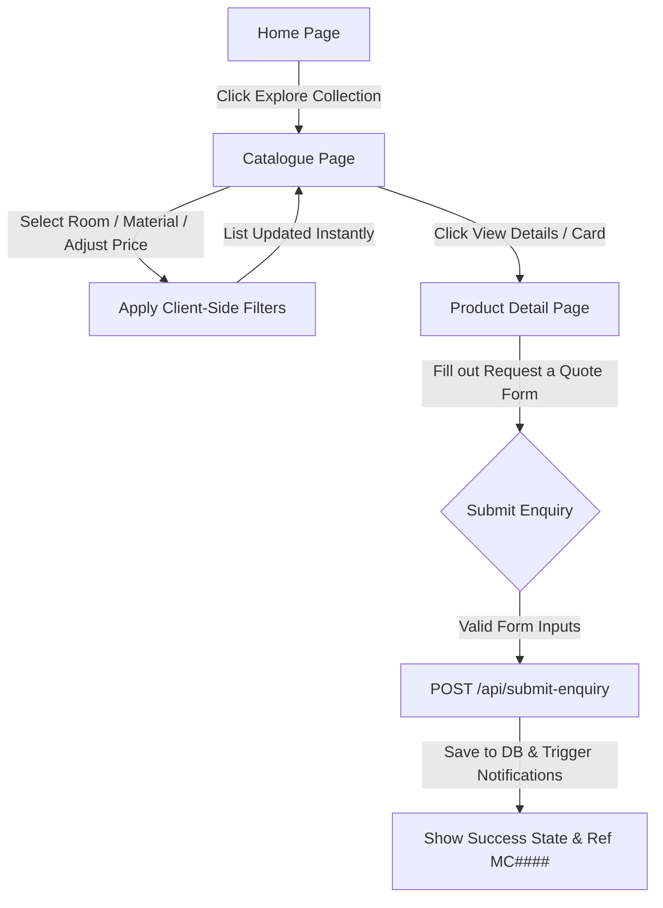
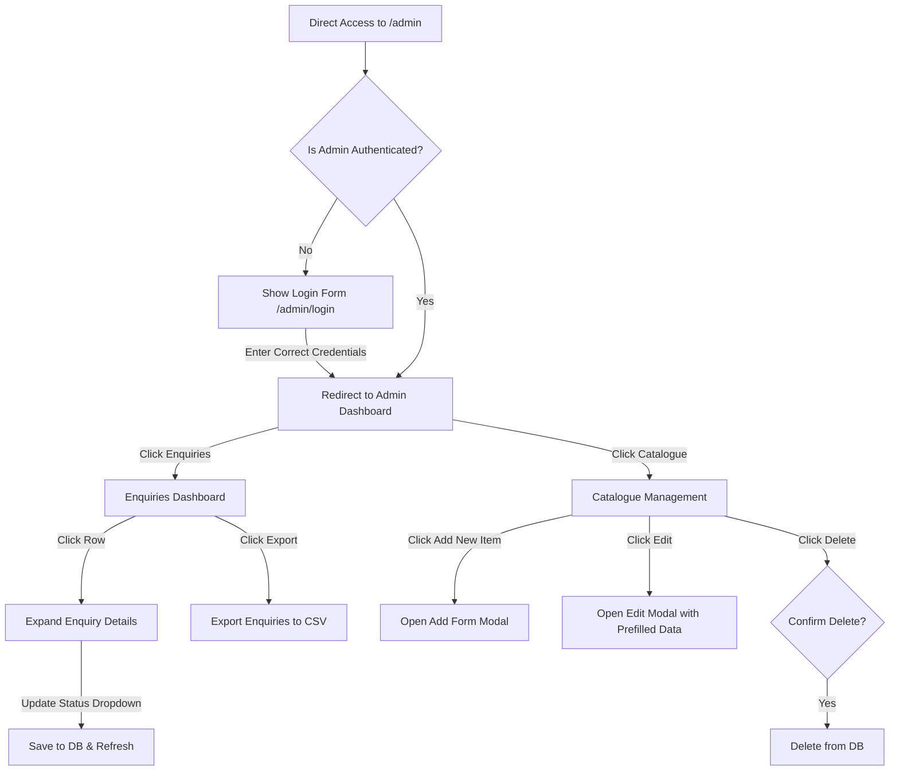
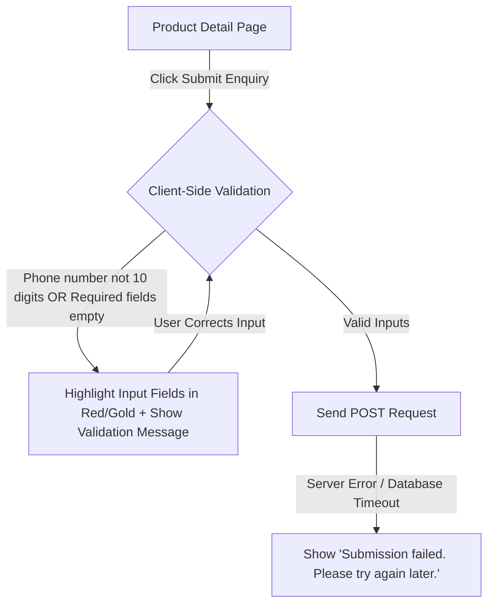
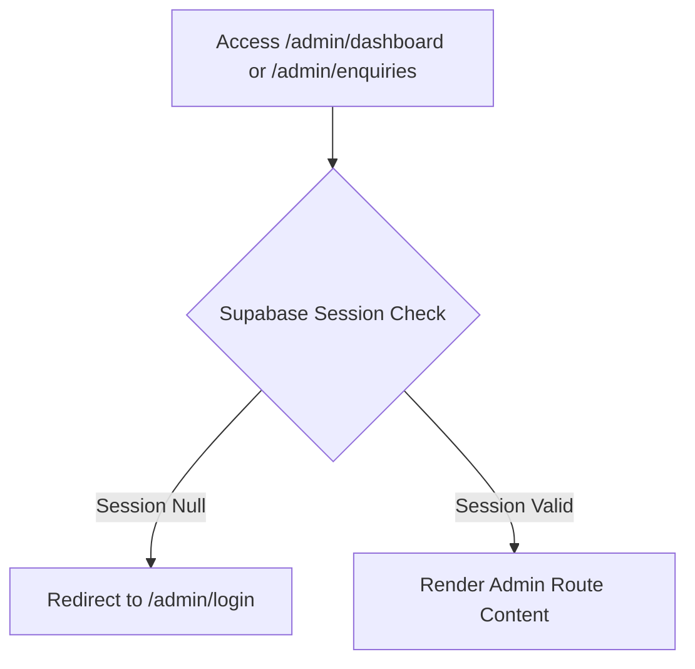
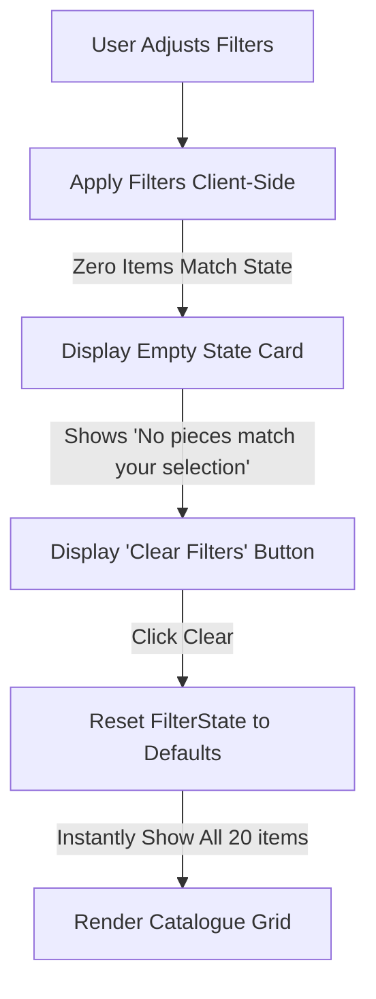

# Maison & Co — User Flow Documentation

This document maps out user interactions across the platform using Mermaid diagrams.

## 1. Customer Browse Flow
This flow tracks the customer journey from the homepage, through browsing and filtering the catalogue, to product detail and quote enquiry submission.

## 2. Admin Flow
Showroom owner enters the administration system via direct URL entry.

## 3. Error Flow: Enquiry Form Validation Fails
Tracks the customer error correction flow on the product detail page.

## 4. Error Flow: Unauthenticated Admin Redirect
Ensures protected admin routes are secure.

## 5. Edge Case: Empty Filter Results
Handles the case when a customer filters items too strictly.

